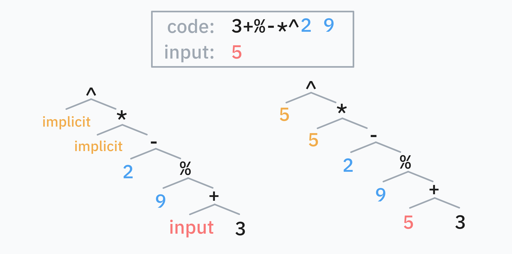

<link rel="preconnect" href="https://fonts.googleapis.com">
<link rel="preconnect" href="https://fonts.gstatic.com" crossorigin>
<link href="https://fonts.googleapis.com/css2?family=Google+Sans+Code:ital,wght@0,300..800;1,300..800&display=swap" rel="stylesheet">
<style>code, pre code { font-family: "Google Sans Code"; }</style>
<style>figcaption{ text-align: center; }</style>

**iogii** is a statically typed language for code golf by _darrenks_, the creator of GolfScript and Nibbles. It features postfix notation, circular programming, and auto-vectorization.


# Basics

## Types and expressions

The basic types in iogii are `int` (arbitrary-precision integer) and `char` (Unicode character). Integers are specified using `0-9` and chars are specified using a preceding `'`. Some basic operators are given below:

| Operator | Type | Description |
| -------- | ---- | ----------- |
| `+` | `int a → a` or `char int → char` | Add |
| `-` | `a int → a` | Subtract |
| `*` | `int int → int` | Multiply |
| `/` | `int int → int` | Divide |
| `%` | `a int → int` | Modulo |
| `^` | `int int → int` | Power |
| `^` | `char char → int` | Subtract chars |
| `~` | `int → int` | Negate |
| `(` | `a → a` | Predecessor (`n-1`) |
| `)` | `a → a` | Successor (`n+1`) |

Expressions in iogii use postfix notation, and tokens may be separated by whitespace: `2 3^` calculates $2^3$. There's no way to write negative integer literals: use the `~` function instead.

## A simple program

The simplest kind of program consists of one or more iogii expressions, whose results are all printed one after another. A line starting with `#` followed by a space is a comment.

This program prints `-1860867j`:

```m4
# Prints (-123)^3 followed by the successor of 'i'
123~3^'i)
```

## Lists

The other type of value in iogii is a list. All items in a list must have the same type.

We'll call the "list of integers" type `[int]`, and "list of list of chars" `[[char]]`, and so on.

List literals may be written using commas between the items. Repeated commas are used to indicate nesting.

* `1,2,3` is a list of integers.
* `1,2,3,,4,5` is a list of lists of integers: [[1, 2, 3], [4, 5]]
* `'a,'β,'c` is a list of characters (a string).
* `5,` is the list [5] of type `[int]`.
* `1,2,3,,4,5,, ,,6` is the list [[1,2,3], [4,5], [], [6]] of type `[[int]]`.
* `'a,'b,,'c,'d,,,'e,'f,'g` is the list [["ab", "cd"], ["efg"]] of type `[[[char]]]`.

Some basic operations on lists include `a` (append), `h` (head), `l` (last), `s` (size). For a complete overview, see the [Quick Reference](https://golfscript.com/iogii/quickref.html).

## Strings

A list of characters `'a,'β,'c` can be written more briefly in double quotes: `"aβc"`.

Inside double quotes, you can use `\` to escape double quotes or other backslashes.

A closing `"` at the end of the program may be omitted.

## Output formatting

Here's how iogii prints values of different types:

+------------+-------------+---------------+--------+
| Type       | Description | Example value | Output |
+============+=============+===============+========+
| `int`      | Single      | `123`         | ```    |
|            | number      |               | 123    |
|            |             |               | ```    |
+------------+-------------+---------------+--------+
| `[int]`    | List of     | `1,2,3`       | ```    |
|            | numbers     |               | 1      |
|            |             |               | 2      |
|            |             |               | 3      |
|            |             |               | ```    |
+------------+-------------+---------------+--------+
| `[[int]]`  | Table of    | `11,2,,3,4,5` | ```    |
|            | numbers     |               | 11 2   |
|            |             |               | 3 4 5  |
|            |             |               | ```    |
+------------+-------------+---------------+--------+
| `char`     | Single      | `'a`          | ```    |
|            | character   |               | a      |
|            |             |               | ```    |
+------------+-------------+---------------+--------+
| `[char]`   | String      | `"hiya"`      | ```    |
|            |             |               | hiya   |
|            |             |               | ```    |
+------------+-------------+---------------+--------+
|`[[char]]`  | List of     |`"two","words"`| ```    |
|            | strings     |               | two    |
|            |             |               | words  |
|            |             |               | ```    |
+------------+-------------+---------------+--------+
|`[[[char]]]`| Table of    |`"ab","c",,"d"`| ```    |
|            | strings     |               | ab c   |
|            |             |               | d      |
|            |             |               | ```    |
+------------+-------------+---------------+--------+

Further levels of nesting are represented using increasing number of blank lines between "layers".


## Truthiness

There is no boolean type in iogii. Values of any type may be "truthy" or "falsey":

* An `int` is falsey if it is zero.
* A `char` is falsey if it is null (`\0`) or ASCII whitespace (`\t\n\v\f\r`).
* A list if falsey if it is empty.

The integers `0` and `1` are used to represent boolean outputs. For example, `n` (not) turns falsey inputs into `1` and truthy inputs into `0`.

## Default values

Some operations involve a type's "default value": this is 0 for `int`, space for `char`, and an empty list for list types.

For exampe, getting the `h`ead of an empty string (`""h`) returns a space.

# Vectorization

A value's **rank** is how many layers of list it's in: `int` and `char` are rank 0, `[int]` and `[char]` rank 1, and so on.

When a operator is applied to an input has lower rank than it expects, it will automatically apply to each element of that input.

```m4
# negate (~) has type int → int
5~
# negate each entry in a rank 1 list:
5,6,7~
# negate each entry in a rank 2 list:
5,6,7,,8,9~

# sum (_) has type [int] → int
1,2,3_
# sum each row:
1,2,3,,4,5,6_
```

## Pointwise application

When an operation with multiple inputs is vectorized, the operation is applied "pointwise" (element-by-element, like adding two vectors in math).

```m4
# Add an offset to a char:
'a2+
# ==> 'c

# Add offsets to string:
"abc"1,2,3+
# ==> "bdf"
```

If one of the inputs is longer than the other, it is truncated to match.

```m4
# Still makes "bdf"
"abcde"1,2,3+

# Outputs: 11 22
#          44 55
10,20,,40,50,60,70  1,2,3,,4,5,,8,9+
```

## Broadcasting

If one of the inputs is lower-rank than the other, it is **broadcasted** (repeated) to match.

```m4
# Add the same offset to each char
"abc"2+
# ==> "cde"

# Add several offsets to the same char
'a8,14,6,8,8+
# ==> "iogii"
```

## Unvectorization

Sometimes, we don't want this auto-vectorization behavior. For example, `s` (size) vectorizes until it finds rank-1 inputs, which means `"hey","there"s` gives us the size of each string, i.e. `3,5`. What if we are interested in the number of strings, i.e. the size of the outer (rank-2) list?

To **unvectorize** an operator, we can put a comma after it. This will make it act on inputs of one higher rank. When the operator is a letter, we can **capitalize** it for the same effect.

```m4
# Both print 2
"hey","there"s,
"hey","there"S
```

We can unvectorize an operator multiple times: `q` (is equal?) compares units, `Q` compares lists, and `Q,` compares lists of lists, and so on.


## Promotion

An input whose rank is too _low_ for its operator will automatically be enclosed in a list of one element.

```m4
# o is "prepend default"
# 'x is promoted to "x", then becomes " x"
# 3 is promoted to [3], then becomes [0,3]
'xo3o
```

## Coercion

If an operation expects `[char]` but an `int` is provided, it will be converted to a string first.

```m4
# a is "append"
# 13 is coerced to "13", yielding "friday13"
"friday"13a
```

# Handling input

If your program is one argument short from a complete expression, it will parse some input from STDIN and use that. (If the interpreter is invoked with `--` followed by arguments, those arguments are used as inputs instead.)

The input can be referred to explicitly using the keyword `input`. Properly golfed code can always find a way around such an explicit reference: for instance see the section on _Missing values_ below.

## Automatic parsing

If the input consists purely of digits, commas, and whitespace, it is parsed as a possibly nested integer list. Otherwise, it's parsed as a string; if there are multiple lines, a list of strings.

For example, the iogii program `)` will apply "successor" to the input. When the input is `99` this prints `100`, but when the input is `99x` it prints `::y` (the successor of each char).

### Raw mode

To prevent automatic parsing of the input, start the program with `,`: this enables **raw mode**. The program `,)` will turn even `99` into `::`.

## Missing values

Actually, iogii has a more complex mechanism for providing **missing values**. If parsing a program causes a "stack underflow", i.e. some operator requires more operands than have been written, iogii will provide values as follows:

1. The closest "missing value" to the start of the program is filled with the 🔴 **input**, as described above.
2. Then, if there are 🔵 **complete, separate expressions at the end** of the source code, those are **popped** and used next.
3. Finally, the variable 🟡 `implicit` is used. Initially, this is also bound to the input, but it can be changed contextually.



### Rotating programs

A useful consequence of this mechanism is that a program like `'x2input^k`, containing a single reference to the input somewhere in the middle, can be **rotated**, moving the values before the input to the end and erasing `input` from the front.

```m4
^k'x2
# i.e. missing missing missing ^ k 'x 2
#    = missing missing input   ^ k 'x 2
#    = 'x      2       input   ^ k
```

# Reusing values

## dup `:` and peek `]`

The special operators `:` (dup) and `]` (peek) repeat previous expressions:

* `a:` is equivalent to `a a`
* `a b]` is equivalent to `a b a`

They make it easy to reuse previously computed values.

```m4
# This program turns "abcdefghijklmnop" into "pon-ponPON"
# (b = backwards, k = keep, U = uppercase)
b3k'-]:U
```

## Setting the implicit value `>`

In iogii, `>` acts like a "right bracket" in various situations. Its simplest use is to set the `implicit` value. In the code that follows `>`, any _missing values_ that resolve to the `implicit` value will reuse the expression before `>`.

```m4
# Gets the length (s) of the input, and
# stores it as the implicit value.
# Then computes s*(2+s):
#
#                    s + * 2
# = missing  missing s + * 2
# = implicit 2       s + *
# = s        2       s + *
#
s>+*2
```

::: {.callout-note}
When resolving _missing values_ after `>`, the "input" is the result of the previous subprogram `s`, not the value parsed from STDIN. In fact, after `>`, the result of the previous subprogram *must* be used: `s>2 2+` causes an error.
:::

## mdup `;`

A common pattern is to transform `x` into something like `f(x)+g(x)`.

One way of achieving this in iogii is the special operator `;f`, where `f` is a **small function**. This turns `x` into `f(x) x`, i.e. it duplicates the input like `:` but applies `f` to the first copy. We can then apply a different function to the second copy and combine the results: `;fg+` turns `x` into `f(x)+g(x)`.

```m4
# input: n, output: (n-1)*(n+1)
;()*
```

This meta-operator `;` is called **mdup**. A **small function** is just a snippet of iogii code, where parsing stops at the earliest prefix that produces exactly one output. Thus `)` and `2+` and `8 8^+` are valid small functions, but `2+3*` is not one, as `2+` already leaves one output.

```m4
# input: n, output: (n-2)*(n+2)
;2-2+*
```

## mpeek `!`

The operator `!f`, where `f` is a small function, transforms `x y` into `f(x) y x`. The meta-operator `!` is called **mpeek**.

Usefully, `g!fh` turns `x y` into `f(x) g(y) h(x)`.

```m4
# input: n, output: (n-1)+2^(n+1)
2!()^+
```

## Assignment

For more complicated value reuse, iogii lets you assign values to named variables.

### Using `set` and `let`

Let's say we want to compute `(foo+3)^3*(foo+4)^4` where `foo` is the length (`s`) of the input.

The long way to write this uses `set foo`, which stores the intermediate value without using it up, and then `foo`, which recalls it:

```m4
# Turns "ab" into (2+3)^3 * (2+4)^4 = 162000
s set foo 3+3^ foo 4+4^ *
```

Equivalently, we can use `let foo`, which does use up the value.

```m4
s let foo
foo 3+3^ foo 4+4^ *
```

### Using `=`

The golf-y way to achieve the same thing uses `=`, which stores an intermediate value into an automatically-chosen variable name.

```m4
# Here, `=` saves the value into `A`.
s=3+3^A4+4^*
```

The way iogii decides the variable name is a bit clever. This example from the official website is a good way to think about it:

> If you use capital letter ops `A`, `C` and `W` now the largest gap is between `C` and `W` so the first use of `=` will save to `D`.

And it offers a trick for using iogii itself to discover which variable it decided to use:

```m4
CWA ===
# → ERROR: 1:6 (=) Sets register 'D' but it is never used
```

# Circular programming

We have a good idea now of how iogii handles functional programming concepts like `map` and `zip`, processing each element in a list in parallel. What about a _fold_ or _scan_, making the elements of a list "talk to one another"?

iogii uses **circular programming**: defining data in terms of itself.

Here's an example of circular programming in Python: defining a generator in terms of itself.

```py
def powers():
    yield 1
    for x in powers():
        yield 2 * x

# Prints: 1, 2, 4, 8, 16, 32, 64
for n in powers():
    print(n)
    if n > 50:
        break
```

Here is a more complex example, showing how circular programming can perform a "scan":

```py
def cumulative_sum():
    yield 0
    for x, y in zip(cumulative_sum(), [1, 2, 3, 4]):
        yield x + y

# Prints: 0, 1, 3, 6, 10
for n in cumulative_sum():
    print(n)
```

## iterate `i`

One primitive for circular programming in iogii is **iterate** `i`.

It is special syntax that's more or less common to all of iogii's circular programming operators. It acts on a preceding argument, the <strong style="color:#0099ff">initial value</strong>, but also on its <strong style="color:#ffaa00">scope</strong>, which is the subexpression it occurs in, demarcated by a closing bracket `>`.

It's easier to explain the behavior of `i` by example. Let's write an iogii program that iterates the function $x \mapsto 2^x \bmod 99$ on starting value 0, and prints the first 50 numbers.

{height=300}

In linked-list terms, `2 0i^99%>` is an infinite list `C` whose head is `0` and whose tail is `2C^99%`.

Another way to think about it is: `C[0]` is `0` and `C[n]` is `(2**C%99)[n-1]` i.e. `2**C[n-1]%99`.

In general, `ηiφ>` is the infinite list `C` whose head is `η` and whose tail is `φ(C)`.

### Circular programming and vectorization

The cumulative sum "scan" example is easy to port as well, and it gives us an example of circular programming with **vectorization**:

```m4
# 4} is the range 1,2,3,4.
0i4}+>
```

This makes the lazy list $C$ whose head is $0$
and whose tail is $C+[1,2,3,4]$. In other words,
due to vectorization, $C[0] = 0$ and

$$ C[n] = (C+[1,2,3,4])[n-1] = C[n-1] + [1,2,3,4][n-1]. $$

Because vectorization stops at the end of the shortest
of two lists, `C` is finite (its tail is as long as $[1,2,3,4]$ so it has length 5 itself).

##
